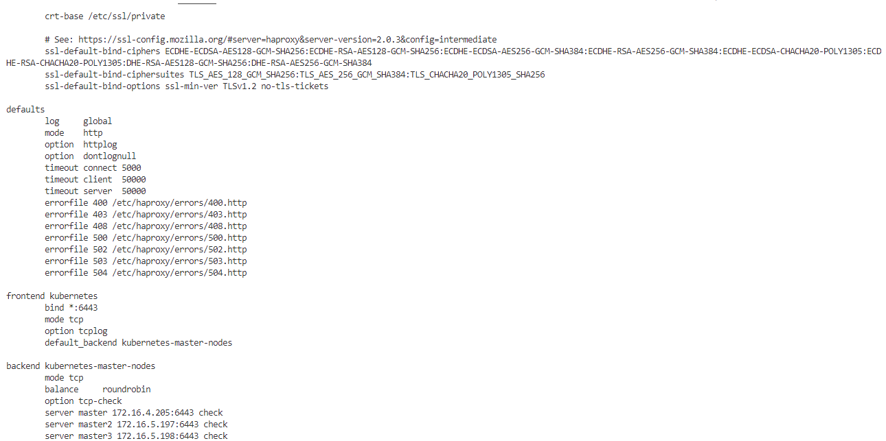
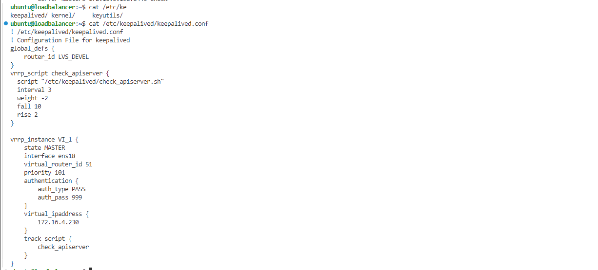
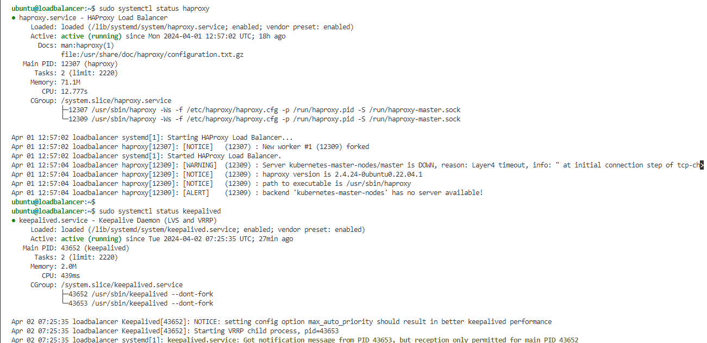
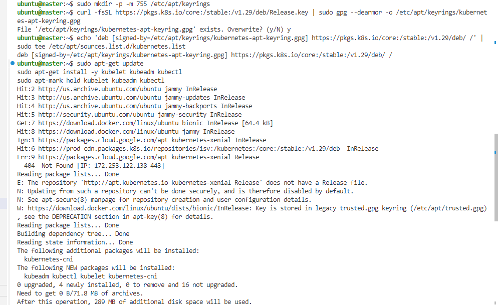
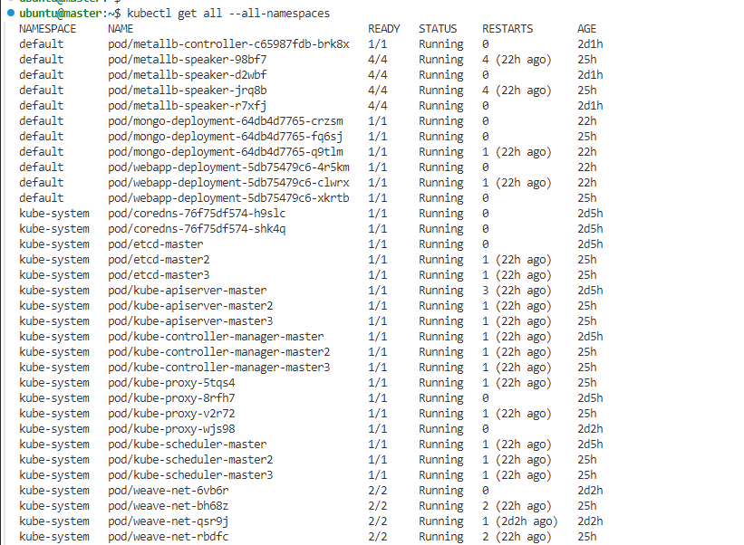
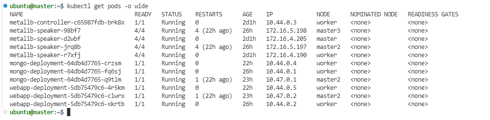

# High Availability & Loadbalancer setup
## Configuring LoadBalancer vm's

### Install haproxy
``` bash

# after installing haproxy, check the version using the below command
haproxy -v  

# OUTPUT 
root@k8s-lb-1:/home/ubuntu# haproxy -v
HAProxy version 2.8.5-1ubuntu3 2024/04/01 - https://haproxy.org/
Status: long-term supported branch - will stop receiving fixes around Q2 2028.
Known bugs: http://www.haproxy.org/bugs/bugs-2.8.5.html
Running on: Linux 6.8.0-31-generic #31-Ubuntu SMP PREEMPT_DYNAMIC Sat Apr 20 00:40:06 UTC 2024 x86_64

```
### Configuring haproxy config file
``` bash
sudo vi /etc/haproxy/haproxy.cfg
```
 

## Edit the file as 
``` bash
# api server frontend which proxys to the control plane nodes.
# mention only port number instead of full ip address
# It directs to the backend services such as master nodes.
frontend kubernetes
        bind *:6443   
        option tcplog
        mode tcp
        default_backend kubernetes-master-nodes 
frontend kubernetes
    bind *:6443
    mode tcp
    option tcplog
    default_backend kubernetes-master-nodes 

backend kubernetes-master-nodes
    mode tcp
    balance     roundrobin
    option tcp-check
    server k8s-master-1 172.16.5.180:6443 check fall 2
```
## Restart the haproxy service 

``` bash
sudo systemctl restart haproxy
# it restarts the haproxy service after newly configuring the file.
```

## Check the status of service

``` bash
sudo systemctl status haproxy
# It must be active and running.
```

## Install keepalived 
``` bash
sudo apt-get update
sudo apt-get install -y keepalived 
``` 

## Configuring Keepalived.conf file

The keepalived configuration consists of two files: the service configuration file and a health check script which will be called periodically to verify that the node holding the virtual IP is still operational.

The files are assumed to reside in a /etc/keepalived directory. Note that however some Linux distributions may keep them elsewhere. The following configuration has been successfully used with keepalived version



### Code without explanation
```bash
! /etc/keepalived/keepalived.conf
! Configuration File for keepalived
global_defs {
    router_id LVS_DEVEL
}
vrrp_script check_apiserver {
  script "/etc/keepalived/check_apiserver.sh"
  interval 3
  weight -2
  fall 5
  rise 5
}

vrrp_instance VI_1 {
    state MASTER
    interface ens18
    virtual_router_id 51
    priority 102
    authentication {
        auth_type PASS
        auth_pass 42
    }
    virtual_ipaddress {
        172.16.5.200
    }
    track_script {
        check_apiserver
    }
}
```
### Code with explanation
``` bash
! /etc/keepalived/keepalived.conf 

# '!' represents the comment.

! Configuration File for keepalived
global_defs { 

  # defines global variables used throughout the configuration

    router_id LVS_DEVEL  
    #  Identifies the router instance
}

# Defines a script that Keepalived will execute at intervals to check the status of the API server.

vrrp_script check_apiserver {
  script "/etc/keepalived/check_apiserver.sh" 
  
  #  Specifies the path to the script that will be executed
  
  interval 3    #  Interval (in seconds) between script executions
  
  weight -2     #  A weight to assign to the script result. Negative values are used to indicate that a failure of the script should decrement the priority of the node.
  fall 5      #   Number of consecutive failed executions of the script that will trigger a transition to the "down" state.  
  rise 5        #   Number of consecutive successful executions of the script that will trigger a transition to the "up" state
}

vrrp_instance VI_1 { 
  
  #  Defines a VRRP (Virtual Router Redundancy Protocol) instance

    state MASTER 
    # specifies the operational state of a node within a VRRP instance. Master for one node and backup for all other nodes. 
    interface ens18 
    #  Specifies the network interface that will be used for VRRP communication 
    virtual_router_id ${ROUTER_ID} 
    # Unique identifier for this VRRP instance.
    priority ${PRIORITY}    
    # This is typically used to determine which node becomes the MASTER
    authentication {
        auth_type PASS 
        auth_pass ${AUTH_PASS} 
        # any password can be entered
    }
    virtual_ipaddress {
        ${APISERVER_VIP} 
        # virtual IP address can be given here
    }
    track_script {
        check_apiserver 
        # which script needs to be tracked.
    }
}
```

## Configuring the check_apiserver file 

```bash
#!/bin/sh

errorExit() {
    echo "*** $*" 1>&2
    exit 1
}

curl -sfk --max-time 2 https://localhost:6443/healthz -o /dev/null || errorExit "Error GET https://localhost:6443/healthz"
```
### Code Explanation 
``` bash 
#!/bin/sh

errorExit() {   
  # This function is defined to print an error message to stderr (standard error) and exit the script with a return code of 1.
    echo "*** $*" 1>&2    
    #  It takes any number of arguments ($*) and prints them as an error message.  redirect stdout to the same destination as stderr .
    exit 1
}

curl --silent --max-time 2 --insecure https://localhost:6443/ -o /dev/null || errorExit "Error GET https://172.16.4.230:6443/"

# here --silent does not print the complete response 
# here --max-time sets the maximum time allowed for the request to complete to 2 seconds
# here --insecure is used to allow connections to SSL sites without certificates.
# -o /dev/null redirects the output of the request to /dev/null, meaning it discards the response.

if ip addr | grep -q 172.16.4.230; then
    curl --silent --max-time 2 --insecure https://172.16.4.230:6443/ -o /dev/null || errorExit "Error GET https://172.16.4.230:6443/"
fi
```

## Restart the Keepalived service

``` bash
sudo systemctl restart keepalived 
``` 

## Enabling the Keepalived service 

```bash 
sudo systemctl enable keepalived --now
``` 

## Check the status of keepalived

```bash
sudo systemctl status keepalived
```
 
 
# Multi-Node Kubernetes Cluster Setup Using Kubeadm

This readme provides step-by-step instructions for setting up a multi-node Kubernetes cluster using Kubeadm.


## Overview
This guide provides detailed instructions for setting up a multi-node Kubernetes cluster using Kubeadm. The guide includes instructions for installing and configuring          
* Docker and Kubernetes
* disabling swap
* initializing the cluster
* installing CNI (Weave)
* joining nodes to the cluster.

## Prerequisites
Before starting the installation process, ensure that the following prerequisites are met:

- You have at least two Ubuntu 18.04 or higher servers available for creating the cluster.
- Each server has at least 2GB of RAM and 2 CPU cores.
- The servers have network connectivity to each other.
- You have root access to each server.

Kubeadm uses any container runtime interfaces of the following:

* Container-d 
* Docker Engine 
NOTE: Only Docker Engine is not supported ,so we need to install cri-dockerd to use docker engine as CRI .
* you need to specify the path for any run-time you choose.
```bash
sudo kubeadm init --cri-socket unix:///var/run/cri-dockerd.sock
```

## Docker Installation
* Setting up apt-repository and add docker official GPG Key
```bash
sudo apt-get update
sudo apt-get install ca-certificates curl
sudo install -m 755 -d /etc/apt/keyrings
sudo curl -fsSL https://download.docker.com/linux/ubuntu/gpg -o /etc/apt/keyrings/docker.asc
sudo chmod a+r /etc/apt/keyrings/docker.asc
```
* Add the repo to apt sources.

``` bash
echo \
  "deb [arch=$(dpkg --print-architecture) signed-by=/etc/apt/keyrings/docker.asc] https://download.docker.com/linux/ubuntu \
  $(. /etc/os-release && echo "$VERSION_CODENAME") stable" | \
  sudo tee /etc/apt/sources.list.d/docker.list > /dev/null
sudo apt-get update
```
* Installing the latest version 

```bash
sudo apt-get install docker-ce docker-ce-cli containerd.io docker-buildx-plugin docker-compose-plugin
# Installing all the required packages.
```


## Installation Steps
The following are the step-by-step instructions for setting up a multi-node Kubernetes cluster using Kubeadm:

Update the system's package list and install necessary dependencies using the following commands:

To install Kubernetes, use the following commands:

(** Official Documentation ** )
``` bash
sudo apt-get update # to update the package index.
sudo apt-get install -y apt-transport-https ca-certificates curl gpg
# If the directory `/etc/apt/keyrings` does not exist, it should be created before the curl command, read the note below.

sudo mkdir -p -m 755 /etc/apt/keyrings
# this command should be run for older versions of debian 12 and ubuntu 22.04 

curl -fsSL https://pkgs.k8s.io/core:/stable:/v1.29/deb/Release.key | sudo gpg --dearmor -o /etc/apt/keyrings/kubernetes-apt-keyring.gpg

# Download the public signing key for the Kubernetes package repositories. The same signing key is used for all repositories so you can disregard the version in the URL

echo 'deb [signed-by=/etc/apt/keyrings/kubernetes-apt-keyring.gpg] https://pkgs.k8s.io/core:/stable:/v1.29/deb/ /' | sudo tee /etc/apt/sources.list.d/kubernetes.list

sudo apt-get update
sudo apt-get install -y kubelet kubeadm kubectl
sudo apt-mark hold kubelet kubeadm kubectl 
sudo systemctl enable --now kubelet
```



## Disable swap
Disable swap using the following command:

```
sudo swapoff -a
```

If there are any swap entries in the /etc/fstab file, remove them using a text editor such as nano:
```
sudo nano /etc/fstab
```

Enable kernel modules
```
sudo modprobe br_netfilter
```

Add some settings to sysctl
```
sudo sysctl -w net.ipv4.ip_forward=1
```
## Initialize the Cluster (Run only on master)
Use the following command to initialize the cluster:
``` bash
# Basic command
# This command initializes the cluster and it throws an error, if swap memory is disabled`.
# if ports are in use already 
sudo kubeadm init --control-plane-endpoint 172.16.4.230:6443 --upload-certs --pod-network-cidr=10.244.0.0/16 --cri-socket unix:///var/run/cri-dockerd.sock
```

Create a .kube directory in your home directory:
``` bash
mkdir -p $HOME/.kube
```

Copy the Kubernetes configuration file to your home directory:
``` bash
sudo cp -i /etc/kubernetes/admin.conf $HOME/.kube/config
```

Change ownership of the file:
``` bash
sudo chown $(id -u):$(id -g) $HOME/.kube/config
```
## Expected Error after Kubeadm init 

unable to initiate kubeadm in the controller node , It says port in use 

Error:
``` bash
WARNING: kubeadm cannot validate component configs `for API groups [kubelet.config.k8s.io kubeproxy.config.k8s.io]`
`[init] Using Kubernetes version: v1.18.19`
`[preflight] Running pre-flight checks`
`error execution phase preflight: [preflight] Some fatal errors occurred:`
`[ERROR Port-10259]: Port 10259 is in use`
`[ERROR Port-10257]: Port 10257 is in use`
`[ERROR FileAvailable--etc-kubernetes-manifests-kube-apiserver.yaml]: `/etc/kubernetes/manifests/kube-apiserver.yaml already exists`
`[ERROR FileAvailable--etc-kubernetes-manifests-kube-controller-manager.yaml]:` `/etc/kubernetes/manifests/kube-controller-manager.yaml already exists`
`[ERROR FileAvailable--etc-kubernetes-manifests-kube-scheduler.yaml]:` /etc/kubernetes/manifests/kube-scheduler.yaml already exists
`[ERROR FileAvailable--etc-kubernetes-manifests-etcd.yaml]: /etc/kubernetes/manifests/etcd.yaml already exists`
`[ERROR Port-10250]: Port 10250 is in use`
`[ERROR Port-2379]: Port 2379 is in use`
`[ERROR Port-2380]: Port 2380 is in use`
`[ERROR DirAvailable--var-lib-etcd]: /var/lib/etcd is not empty`
 [preflight] If you know what you are doing, you can make a check non-fatal with `--ignore-preflight-errors=...`
 To see the stack trace of this error execute with --v=5 or higher
```

SOLUTION:
``` bash 
kubeadm reset  # reset the kubeadm, so that all the changes are undone for the starting.
systemctl restart kubelet # Kubelet service is stopped from the reset stage so that the service is started again.
kubeadm init # Now you can no longer see the error.
```

## Install Weave CNI  (Run only on master)
Use the following command to install Weave CNI :

```bash
# to install weave CNI
kubectl apply -f https://github.com/weaveworks/weave/releases/download/v2.8.1/weave-daemonset-k8s.yaml

# to uninstall weave CNI
kubectl delete -f https://github.com/weaveworks/weave/releases/download/v2.8.1/weave-daemonset-k8s.yaml
```

## Verify Installation
Verify that all the pods are up and running:



``` bash
kubectl get pods --all-namespaces 
# checks all the pods with name and namespaces and their ready, status including no.of restarts. 

kubectl get pods -n kube-system --output = wide 
# to get all the pods in the speciied namespace 
```


## Join Nodes
To add nodes to the cluster, run the kubeadm join command with the appropriate arguments on each node. The command will output a token that can be used to join the node to the cluster.

``` bash
sudo kubeadm join 172.16.4.221:6443 --token hdsghn.iybm6c585jynm8iz \
        --discovery-token-ca-cert-hash sha256:a7badd960011f6f77aec87ed8b0fd3f0507cc9af73bb0cbf09283bbfc11a9fb2 

# you can use this command to connect the worker node to the master node 
# use the command: kubectl get nodes 
# This will list out the master and the worker nodes.
```


*** If you miss this join command or token expired ***

## token creation
``` bash
kubeadm token create --print-join-command
# prints the join command along with the newly created token.
kubeadm token list
# print all the tokens created.
```

## certificate generation
``` bash
sudo kubeadm init phase certs all --apiserver-advertise-address=172.16.4.230
sudo kubeadm init phase upload-certs --upload-certs
# this will generate a certificate key which we can use it in join commands of master node
```

## Explicit join command to master and worker nodes

```bash
sudo kubeadm join <master_ip:port> --token hdsghn.iybm6c585jynm8iz \
        --discovery-token-ca-cert-hash sha256:a7badd960011f6f77aec87ed8b0fd3f0507cc9af73bb0cbf09283bbfc11a9fb2  --control-plane certificate-key <cert_key>

# Here, the --control-plane tag is used to join the node as a control-plane node.
# This cert key is substituted with the value that is output from the certificate generation command above this.
```

## making master work as worker node

``` bash
kubectl taint nodes master2 node-role.kubernetes.io/control-panel:NoSchedule-

# to make the master node schedule the pods and workable we need to remove the NoSchedule taint. 

kubectl taint nodes master2 node-role.kubernetes.io/control-panel:NoSchedule

# If we want the master node to not schedule the pods we need to add this taint.
```
## Worker node labelling 
```bash
kubectl label nodes  worker  node-role.kubernetes.io/worker=worker

# This is used to make the role of worker from <none> to worker so that it can accept the pods.
```


## Basic NGINX File

``` yaml
apiVersion: apps/v1
kind: Deployment
metadata:
  name: nginx-deployment
  labels:
    app: nginx-deploy-app
spec:
  replicas: 2
  selector:
    matchLabels:
      app: nginx
  template:
    metadata:
      labels:
        app: nginx
    spec:
      containers:
      - name: nginx
        image: nginx:1.14.2
        ports:
        - containerPort: 80
---
apiVersion: v1
kind: Service
metadata:
  name: nginx-service
spec:
  selector:
    app: nginx
  ports:
    - protocol: TCP
      port: 80
      targetPort: 80 
  type: LoadBalancer
```

## Implementing Loadbalancer using MetalLB

#### Installing HELM on Master Node

```bash
curl https://baltocdn.com/helm/signing.asc | gpg --dearmor | sudo tee /usr/share/keyrings/helm.gpg > /dev/null
sudo apt-get install apt-transport-https --yes
echo "deb [arch=$(dpkg --print-architecture) signed-by=/usr/share/keyrings/helm.gpg] https://baltocdn.com/helm/stable/debian/ all main" | sudo tee /etc/apt/sources.list.d/helm-stable-debian.list
sudo apt-get update
sudo apt-get install helm
```

#### Installing MetalLB using HELM

``` bash
helm repo add metallb https://metallb.github.io/metallb

helm install metallb metallb/metallb # for installing 

helm uninstall metallb metallb/metallb # for uninstalling
```
#### Configuring the values.yaml file

``` yaml
apiVersion: metallb.io/v1beta1
kind: IPAddressPool
metadata:
  name: first-pool
  namespace: default
spec:
  addresses:
  - 172.16.6.10-172.16.6.20
---
apiVersion: metallb.io/v1beta1
kind: L2Advertisement
metadata:
  name: example
  namespace: default
```
``` bash
kubectl apply -f values.yaml
```

## Accessing through Browser

``` bash
kubectl get services

# you can find the External IP address for the metallb service and use it for accessing the application.
```


``` bash
NAME                      TYPE           CLUSTER-IP       EXTERNAL-IP   PORT(S)        AGE
kubernetes                ClusterIP      10.96.0.1        <none>        443/TCP        2d5h
metallb-webhook-service   ClusterIP      10.104.33.211    <none>        443/TCP        2d1h
mongo-service             ClusterIP      10.104.135.64    <none>        27017/TCP      25h
webapp-service            LoadBalancer   10.110.167.220    '<172.16.6.10>'   80:30920/TCP   25h
```